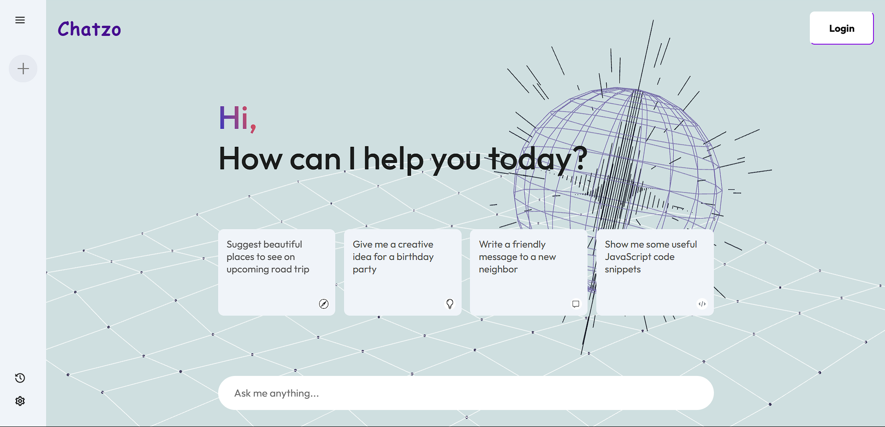
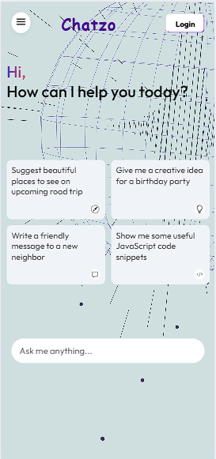

# 🌐 Chatzo - AI Chat Application

<div align="center">
  
  
  
  
</div>

<div align="center">
  <h3>🚀 A modern AI-powered chat application with stunning 3D visuals</h3>
  <p>Experience the future of conversational AI with an immersive globe background</p>
  
  **🌐 [Live Demo: chatzou.netlify.app](https://chatzou.netlify.app/)**
</div>

---

## ✨ Features

- 🤖 **AI-Powered Conversations** - Intelligent responses using advanced AI
- 🌍 **Interactive 3D Globe** - Beautiful Vanta.js globe background with mouse/touch controls
- 📱 **Fully Responsive** - Seamless experience across desktop, tablet, and mobile
- 🔐 **User Authentication** - Secure login/logout with Netlify Identity
- 💾 **Chat History** - Persistent conversation history with easy access
- 🎨 **Modern UI/UX** - Clean, intuitive interface with smooth animations
- ⚡ **Real-time Responses** - Fast AI responses with loading indicators
- 📋 **Quick Prompts** - Pre-built conversation starters for instant engagement

## 🛠️ Tech Stack

| Technology | Purpose |
|------------|---------|
| **React.js** | Frontend framework |
| **Vanta.js + Three.js** | 3D background animations |
| **Netlify Identity** | User authentication |
| **CSS3** | Responsive styling |
| **Context API** | State management |

## 🚀 Quick Start

### Prerequisites

- Node.js (v16 or higher)
- npm or yarn
- Git

### Installation

1. **Clone the repository**
   ```bash
   git clone https://github.com/utsab357/chatzo.git
   cd chatzo
   ```

2. **Install dependencies**
   ```bash
   npm install
   ```

3. **Set up environment variables**
   ```bash
   cp .env.example .env.local
   ```
   Add your API keys to `.env.local`

4. **Start the development server**
   ```bash
   npm start
   ```

5. **Open your browser**
   Navigate to `http://localhost:3000`

## 🌐 Live Demo

**Try it now:** [https://chatzou.netlify.app/](https://chatzou.netlify.app/)

### What you can do:
- 💬 Start chatting with AI instantly
- 🎯 Use quick prompt cards for inspiration
- 📱 Test the responsive design on mobile
- 🔐 Sign up/login to save your chat history
- 🌍 Interact with the beautiful 3D globe background

## 📱 Screenshots

<div align="center">
  
  
</div>

*Screenshots coming soon - experience the live demo above!*

## 🏗️ Project Structure

```
src/
├── components/
│   ├── Main/
│   │   ├── Main.jsx
│   │   └── Main.css
│   └── Sidebar/
│       ├── Sidebar.jsx
│       └── Sidebar.css
├── context/
│   └── Context.jsx
├── assets/
│   └── assets.js
└── App.js
```

## 🎯 Key Components

### Main Component
- **3D Globe Background**: Interactive Vanta.js globe with customizable colors
- **AI Chat Interface**: Clean chat UI with typing indicators
- **Responsive Cards**: Quick-start conversation prompts
- **Authentication**: Integrated Netlify Identity widget

### Sidebar Component
- **Chat History**: Persistent conversation storage
- **Mobile Navigation**: Slide-out sidebar for mobile devices
- **Activity Tracker**: Easy access to previous conversations

## 🔧 Configuration

### Vanta.js Globe Settings
```javascript
{
  mouseControls: true,
  touchControls: true,
  gyroControls: false,
  scale: 1.0,
  scaleMobile: 1.0,
  color: 0x7f79ae,
  color2: 0x010410,
  backgroundColor: 0xcfdfe0
}
```

### Responsive Breakpoints
- **Desktop**: `min-width: 601px`
- **Mobile**: `max-width: 600px`

## 🚀 Deployment

This project is deployed on **Netlify** at [chatzou.netlify.app](https://chatzou.netlify.app/)

### Deploy your own copy:

#### Netlify (Recommended)
1. **Fork this repository**
2. **Connect to Netlify**
   - Go to [netlify.com](https://netlify.com)
   - Connect your GitHub account
   - Select your forked repository
3. **Configure build settings**
   - Build command: `npm run build`
   - Publish directory: `build`
4. **Deploy!**

#### Vercel
1. **Install Vercel CLI**
   ```bash
   npm i -g vercel
   ```
2. **Deploy**
   ```bash
   vercel --prod
   ```

## 🤝 Contributing

We welcome contributions! Please follow these steps:

1. Fork the repository
2. Create a feature branch (`git checkout -b feature/AmazingFeature`)
3. Commit your changes (`git commit -m 'Add some AmazingFeature'`)
4. Push to the branch (`git push origin feature/AmazingFeature`)
5. Open a Pull Request

## 📄 License

This project is licensed under the MIT License - see the [LICENSE](LICENSE) file for details.

## 🙏 Acknowledgments

- [Vanta.js](https://www.vantajs.com/) for the stunning 3D backgrounds
- [Three.js](https://threejs.org/) for 3D graphics
- [Netlify Identity](https://docs.netlify.com/visitor-access/identity/) for authentication
- [React](https://reactjs.org/) for the amazing framework

## 📞 Support

If you have any questions or need help, please:

- 🌐 **Live Demo**: [chatzou.netlify.app](https://chatzou.netlify.app/)
- 🐛 [Open an issue](https://github.com/utsab357/chatzo/issues)
- 💬 [Start a discussion](https://github.com/utsab357/chatzo/discussions)

---

<div align="center">
  <p>Made with ❤️ by <a href="https://github.com/utsab357">Utsab</a></p>
  <p>🌐 <strong><a href="https://chatzou.netlify.app/">Try Chatzo Live</a></strong> | ⭐ Star this repo if you found it helpful!</p>
</div>
